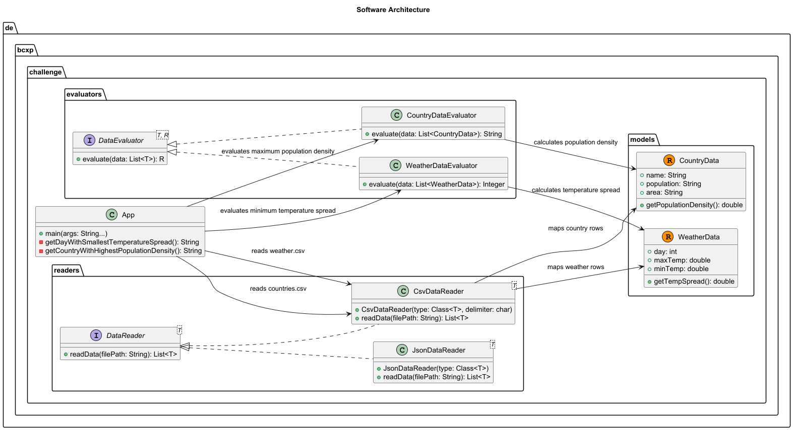

# BettercallPaul Programming Challenge

The application reads CSV data, validates it, calculates the required result, and prints the answer for two related tasks:

- Weather: find the day with the smallest temperature spread (`MxT - MnT`)
- Countries: find the country with the highest population density (`Population / Area`)

## Goals

The implementation focuses on:

- correctness
- maintainability
- readability
- clean architecture
- testability

## Project structure

```text
bcxp-programming-challenge/
├── docs/
│   ├── architecture_diagram.png
│   ├── architecture_diagram.puml
│   └── README.md
├── src/
│   ├── main/
│   │   ├── java/
│   │   │   └── de/bcxp/challenge/
│   │   │       ├── App.java
│   │   │       ├── exceptions/
│   │   │       │   └── EmptyDataException.java
│   │   │       ├── evaluators/
│   │   │       │   ├── DataEvaluator.java
│   │   │       │   ├── WeatherDataEvaluator.java
│   │   │       │   └── CountryDataEvaluator.java
│   │   │       ├── models/
│   │   │       │   ├── WeatherData.java
│   │   │       │   └── CountryData.java
│   │   │       └── readers/
│   │   │           ├── DataReader.java
│   │   │           ├── CsvDataReader.java
│   │   │           └── JsonDataReader.java
│   │   └── resources/
│   │       └── de/bcxp/challenge/
│   │           ├── weather.csv
│   │           ├── weather.json
│   │           ├── countries.csv
│   │           └── countries.json
│   └── test/
│       ├── java/
│       │   └── de/bcxp/challenge/
│       │       ├── WeatherIntegrationTest.java
│       │       ├── CountryIntegrationTest.java
│       │       ├── evaluators/
│       │       │   ├── WeatherDataEvaluatorTest.java
│       │       │   └── CountryDataEvaluatorTest.java
│       │       └── readers/
│       │           └── CsvDataReaderTest.java
│       └── resources/
│           └── de.bcxp.challenge/
│               ├── weather.csv
│               ├── countries.csv
│               └── empty_weather.csv
├── pom.xml
```

## Architecture



The application follows a simple separation-of-concerns design:

- `App` is the application entry point and orchestrates the reading, evaluating, and printing of results
- `CsvDataReader` parses CSV files and maps them to Java records for the domain model
- `WeatherData` and `CountryData` represent the domain model and validate data
- `WeatherDataEvaluator` and `CountryDataEvaluator` contain the business logic for calculating the required results

This makes the code easier to extend and keeps the responsibilities clearly separated.

## Design decisions

### 1. Separation of concerns
Each component has a single responsibility:

- reading data
- validating data
- calculating results
- running the program

This makes the solution easier to maintain and improve.

### 2. Replaceable readers
The project defines a generic `DataReader<T>` interface. This means the data source could be changed later without changing the evaluator logic.

For example, the same architecture could support:

- CSV files
- JSON files
- web services
- database sources

### 3. Validation in the model
The record classes validate their own data:

- `WeatherData` checks valid day numbers and temperatures
- `CountryData` checks valid names, population, and area values

This prevents invalid objects from entering the system.

### 4. Explicit error handling
The application does check invalid input. It raises clear exceptions for:

- empty files
- invalid numbers
- missing fields
- invalid ranges

This makes debugging and future maintenance easier.

### 5. Reusable logic
The same overall architecture works for both tasks, even though the calculation differs. That demonstrates a reusable design rather than a one-off solution.

## Why Jackson?
The CSV reader uses Jackson because it provides a clean and reliable way to map CSV columns directly to Java objects through annotations such as `@JsonProperty`.
This reduces manual parsing logic and keeps the code more readable. Also, it is a widely used library with good performance and support for various data formats especially for JSON.

## Running the application

Use Maven:

```bash
mvn clean verify
mvn exec:java
```

## Running tests

```bash
mvn test
```
